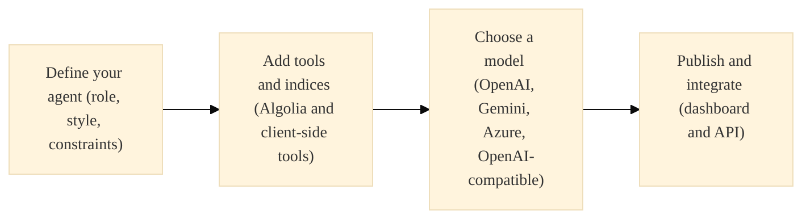
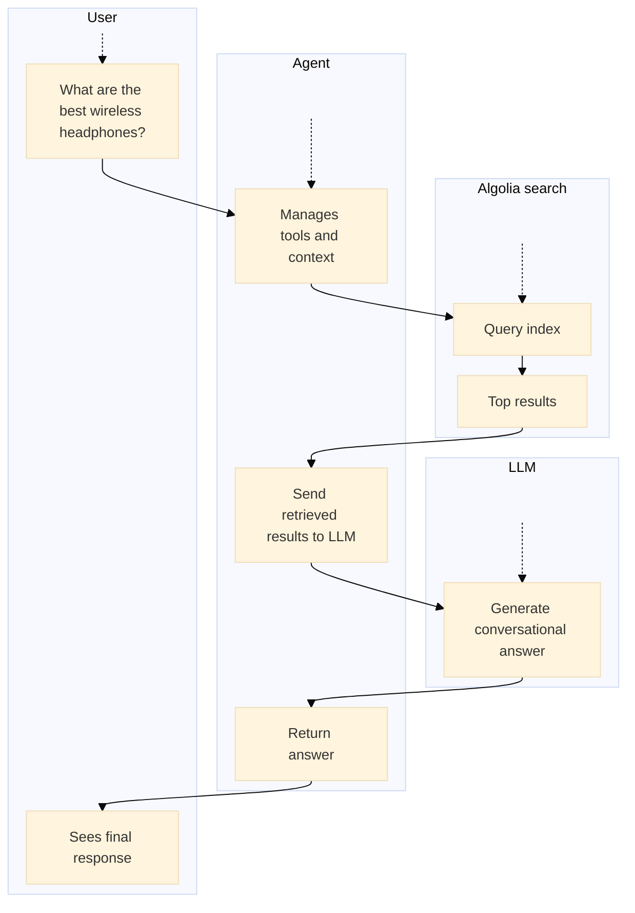

# Agent Studio

> Build generative AI experiences with real-time Algolia data and LLMs like OpenAI and Gemini.

export const DemoButton = ({href, icon, children}) => {
  return <a className="not-prose demo-btn" href={href} rel="noreferrer noopener" target="_blank">
      {icon && <Icon icon={icon} color="var(--tw-prose-body)" />}
      {children || View demo}
    </a>;
};

<Callout icon="flask-conical" color="#14b8a6">
  This is a **beta feature** according to [Algolia's Terms of Service ("Beta Services")](https://www.algolia.com/policies/terms/).
</Callout>

Agent Studio connects your chosen LLM to Algolia search and tools.
It manages the end-to-end workflow and grounds responses in live data from your Algolia indices.
Agent Studio lets you create:

* **Shopping assistants** that answer product questions and recommend items.
* **Content summarizers** that extract key insights from large datasets.
* **Conversational search** for natural language queries.
* **Custom workflows** that link prompts to Algolia features and external integrations.

  <DemoButton href="/doc/guides/algolia-ai/agent-studio/how-to/quickstart" icon="bot">
    Create your first conversational assistant
  </DemoButton>

## How Agent Studio works

Agent Studio coordinates between user input, Algolia tools and indices,
and the selected LLM to create a generative AI workflow:

For example:

<Check>
  Search requests made by agents count towards your total search usage and may incur additional charges on your Algolia account.
</Check>

**Cost optimization**

Completions are [cached](/doc/guides/algolia-ai/agent-studio/how-to/caching) by default to minimize your LLM provider token costs.

## See also

* [Agent Studio dashboard](/doc/guides/algolia-ai/agent-studio/how-to/dashboard)
* [InstantSearch.js chat widget](/doc/api-reference/widgets/chat/js)
* [React InstantSearch chat widget](/doc/api-reference/widgets/chat/react)
* [Integrate Agent Studio](/doc/guides/algolia-ai/agent-studio/how-to/integration)
* [Prompting tips](/doc/guides/algolia-ai/agent-studio/how-to/prompting)

---

> To find navigation and other pages in this documentation, fetch the llms.txt file at: https://algolia.com/llms.txt
